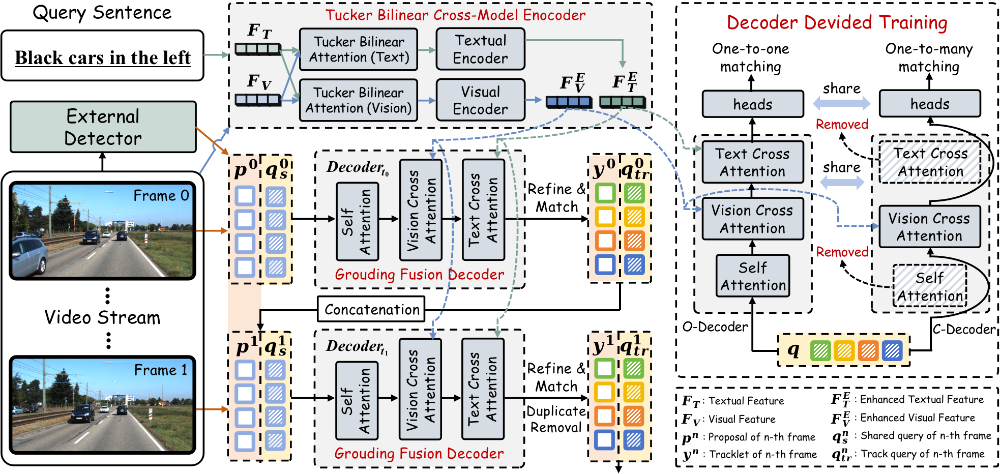

<h1>
<b>
Conflict-Free Decoder Learning with Tucker Bilinear Fusion for Transformer-based Reference Multi-Object Tracking</b>
</h1>

**Abstract.**
Benefiting from the flexibility and generality of natural-language-guided vision understanding in real-world scenarios, reference multi-object tracking (RMOT) has attracted more attention from the vision community. However, existing transformer-based RMOT methods have shown suboptimal performance due to two inevitable conflicts during training decoder: (1) the competing objectives of jointly learning cross-modal fusion, object detection, and data association tasks; and (2) the opposing effects of self-attention layers and cross-attention layers within the decoder on the queries. To solve them, we propose \textcolor{red}{Conflict-Free Decoder Learning with  Tucker Bilinear Fusion for Transformer-based Reference Multi-Object Tracking}, denoted as CoFr-Track. Specifically, to alleviate the responsibility of the decoder for handling the entire detection process, we utilize the external object detector to generate high-quality proposals as anchors, providing location priors for RMOT. To mitigate the burden of cross-modal fusion on the decoder, we propose the Tucker Bilinear Cross-Modal Encoder module, which extracts mutually enhanced and discriminative visual and text embeddings through Tucker Bilinear Fusion. Additionally, we introduce the Grounding Fusion Decoder, which contains two distinct cross-attention layers that separately receive these embeddings and focus on data association and reference matching. To address the learning conflict between the self-attention and cross-attention layers, we adopt an attention-divided training strategy, which employs an auxiliary decoder that focuses on learning the vision cross-attention layers. While sharing all the other parameters, the auxiliary decoder has NO self-attention layers and employs the one-to-many label matching to improve the gathering effect. Comparisons with state-of-the-art methods on the benchmark dataset demonstrate the superiority of the proposed method, while extensive ablation studies and analyses validate the effectiveness of its key modules.

## Main Results

### Ref-KITTI

| **Method** | **Dataset** | **HOTA** | **DetA** | **AssA** | **DetRe** | **DetPr** | **AssRe** | **AssRe** |                                                      
|:----------:|:-----------:|:--------:|:--------:|:--------:|:---------:|:---------:|:---------:|-----------|
| CoFr-Track  | Refer-KITTI |  49.56   |  37.95   |  64.86   |   50.83   |   58.53   |   70.44   | 86.75     |
